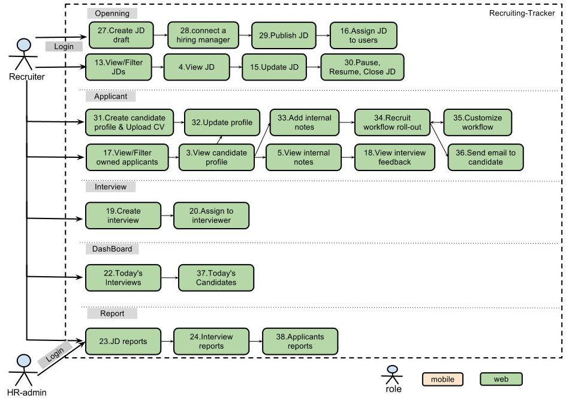
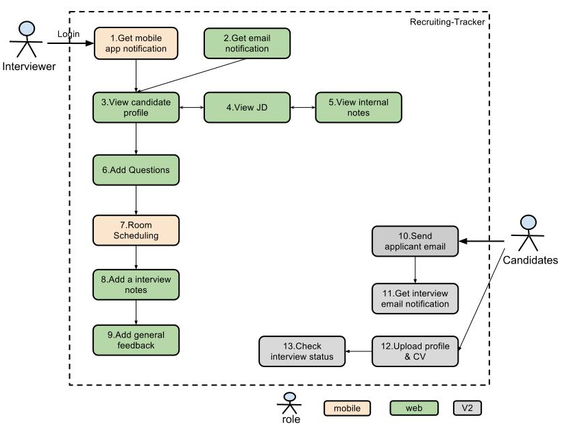
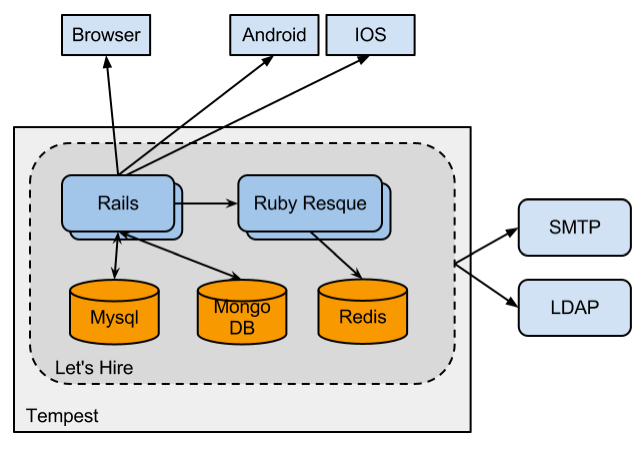
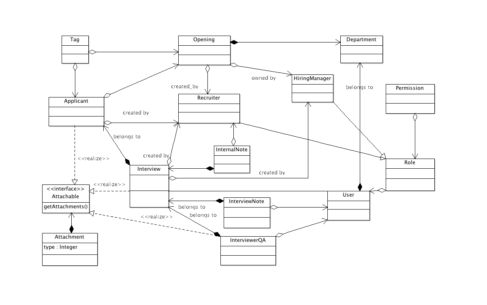

#Let's Hire
##Scope

The scope of this project is to create a self-contained Recruiting system, which is applicable for recruiting and interview workflow suitable for most companies. It has the features, 
including:

* Job opening’s creation and management;
* Applicant's one-stop management;
* Smooth and customizable recruiting workflow;  
* Hiring team interview collaboration support;
* All recruitment information & talent pool in one place.
* Mobile app for interviews

##Roles
We divide users of the recruiting system into mutiple roles:
#####Interviewer
The interviewer is just the common user for the system. Interviewers are nominated by Hiring Manager and complete the interview arranged to him. 
#####Recruiter
The role who specially engages in filling jobs or positions for the company. The recruiter also add the candidates and upload the CVs.
#####Hiring Manager
Each JD, or opening, has a Hire manager, who knows the responsibilities and qualification for the opening. And he cooperate with recruiter for find the right candidate to fill the position.
#####System Admin
The role who usually doesn’t involve into specific recruitment procedure directly. but would like to manage the users, departments and config the SMTP, LDAP server info.

##Work process
#####Recruiter's Perspective

#####Hiring Manager's Perspective

#####Interviewer's Perspective

##Architecture

We use **Rails** to develop the web application. For the scheduled and asynchronous email notification, we choose to use the **Resque** and **Resque scheduler**. These apps will be deployed as standalone application.

For the services, we use **MySQL** to store the business data. **MongoDB** will be used to store the uploaded CVs and pictures, audio files. **Redis** works as the backend queue for **Resque**.

For the mobile clients, we should support the **Android** and **IOS** platform app.

The system need to integrate with the enterprise **SMTP** and **LDAP** server. Then we can use the service to send email and authorize user. 

##Components

##Domain model

